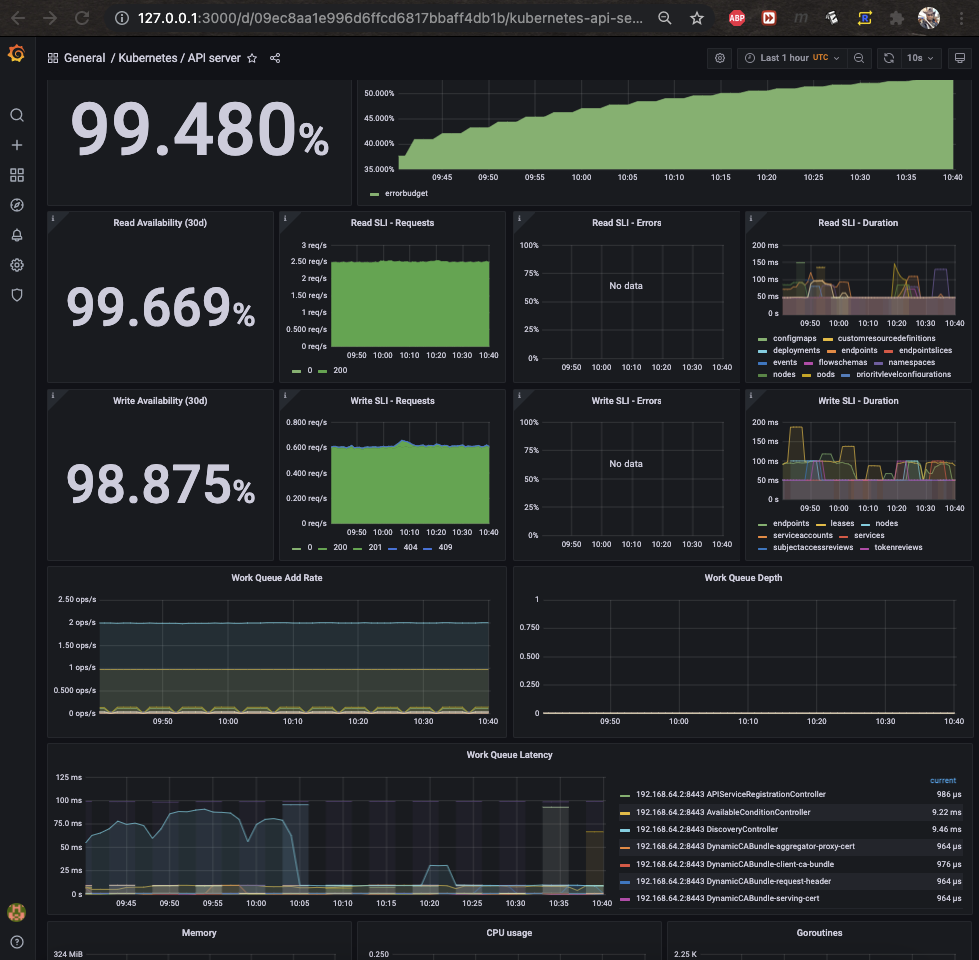

# Monitoring Kubernetes With Prometheus & Grafana

<p float="left">
  

  
  
  
</p>

----


## Introduction

**Prometheus** is an open-source monitoring software that is highly customizable and collects metrics without hindering application performance. It's widely known for it's effective monitoring of cloud-native applications, microservices and infrastructure.

**Grafana** is also an open-source software used to monitor infrastructure and log analytics to enhance operational efficiency.

## Prometheus Architecture

Prometheus Server processes and stores data. It enables retrieval by pulling metrics data and also accepts queries from HTTP servers. On top of Premetheus Web UI, you can build **Grafana** for data visualization creating powerful visualization dashboards from Prometheus metric data.

## Deployment in K8s Cluster

This can be done in three fold. The first way has a high operational overhead and it's a tad too inefficient. The second way is by using the Prometheus operator whilst the third uses Helm chart.

1. Create all configuration YAML files and execute them in right order.
   * Prometheus
   * Alertmanager
   * Grafana
2. Using Operator
   * Find Prometheus operator
   * Deploy in K8s cluster
3. Using Helm chart to deploy to operator
   * Maintained by Helm community

## Installation and Demo

**[Prometheus operator](https://github.com/helm/charts/tree/master/stable/prometheus-operator)** development is deprecated and the new chart is **[kube-prometheus-stack](https://github.com/prometheus-community/helm-charts/tree/main/charts/kube-prometheus-stack)** where installation guideline is provided. Make sure you have **[helm](https://helm.sh/docs/topics/charts/)** installed before proceeding.

Some deprecation warnings will be thrown because the project moved from prometheus-operator to kube-premetheus-stack.


If I access my localhost on port 3000, I'm able to view the Grafana welcome login screen.


Once inside the Grafana UI, there is loads you can do. You can configure scraping metrics, dashboard, networking, etc.


If you go to **Dashboard** and select **Manage**, you'll see the data Prometheus is already scraping.


If I select the **Nodes** I can see the Memory usage, CPU Usage, Load Average, Disk Space etc. These metrics don't represent your local system metrics but what's happening in your cluster.
Since I'm running my virtualization with **Minikube**, I can check whether the two IPs correspond.


</hr>


</hr>


Poking things around, I can also check the compute resources of the Pods and their utilization. I can check networking like bandwidth, packet transmissions etc

You can also monitor master processes like Schedulers, API server, etc. I'll grab the API server metric dashboard. Important to know is that monitoring is in real time, no need to keep fetching the dashboard again or refreshing browser.



It's also possible to create your own custom dashboards in order to drill down and monitor at a finer level of granularity. I won't go in depth with that but the landing page of Grafana has excellent tutorials.

Apart from the repos which I had to pull in, with a few commands I was able to instantiate **alertmanager, grafana, kube-prometheus-operator, kube-state-metrics, prometheus-kube an d prometheus-node**. As K8s continue to evolve, certainly the libraries and tools are also evolving at a fast pace. I'll add the installation process I did today here and track what will change in future or if anyone wants to set up their infrastructure.

### Helm

```shell
# LINUX Helm
  curl https://baltocdn.com/helm/signing.asc | sudo apt-key add -
  sudo apt-get install apt-transport-https --yes
  echo "deb https://baltocdn.com/helm/stable/debian/ all main" | sudo tee /etc/apt/sources.list.d/helm-stable-debian.list
  sudo apt-get update
  sudo apt-get install helm

# macOS Helm
brew install helm
```

### Repositories

```shell
  helm repo add prometheus-community https://prometheus-community.github.io/helm-charts
  helm repo add stable https://charts.helm.sh/stable
  helm repo add stable https://charts.helm.sh/stable
  helm repo update
```

### Installing Prometheus

```shell
  helm install prometheus prometheus-community/kube-prometheus-stack
```

### K8s Prometheus Port Forwarding

```shell
  kubectl port-forward deployment/prometheus-grafana 3000

```


Digging deeper, we can see there were many ConfigMaps which were created. They are basically configurations for different parts managed by operator. Secrets were also created for Grafana, Prometheus, Operator which include certificates, login credentials,  etc. If I were to set up all the YAML files and configurations for all this instead of using open-source tools, it would be time consuming and prone to error.


Also created were Custom Resource Definitions (CRD)


To get more information about **StatefulSets** and **Deployment**, what images and versions are running, config files, certificates etc, we can grab the config files by redirecting them as output in a YAML files.


In addition to Grafana, Prometheus has it's own UI as well, which we can access using port forwarding. From the YAML file I created a redirect from, I can see it uses port 9090. So let's poke things around.


Prometheus landing page


Checking Alerts. You can check whats happening in each individual alert.


The configuration file is also available which is very long with a somewhat *steep learning curve* depending on how busy you are. I'm extremely busy :-)


Prometheus also can show targets of each component been **scraped**, their state, whether **up** or **down** and if down, a possible cause is shown in the **Error** option.


Rules and configurations


In a nutshell, Prometheus and Grafana help in tackling problems related to complex data in a simplified way. With Grafana, you understand complex data with the help of data metrics visualization. Prometheus is great in monitoring microservices because at times you may have hundreds of Pods running applications which can have a high overhead. Scraping metrics and generating alerts can point to problems much easily.
